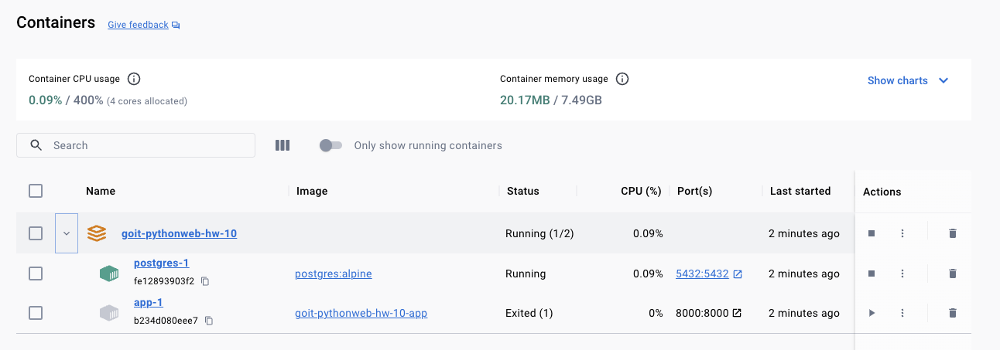

# Contact Management REST API

**Goal:** The goal of this homework assignment is to create a REST API for storing and managing contacts. The API should be built using the FastAPI infrastructure and should use SQLAlchemy to manage the database.

**Tech Stack:**

- FastAPI framework
- SQLAlchemy ORM
- PostgreSQL database
- Pydantic for data validation

**Requirements:**

1.  **Contact Data:** Store first name, last name, email, phone number, birthday, and optional additional data.

2.  **API Endpoints (CRUD):**

    - Create contact
    - Get all contacts
    - Get contact by ID
    - Update contact
    - Delete contact

3.  **Additional Features:**

    - Search contacts by name, last name, or email (using query parameters).
    - Get a list of contacts with birthdays in the next 7 days.

4.  **Deliverables:**
    - Functional REST API
    - PostgreSQL database integration
    - Support for storing contact birthdays
    - Swagger documentation
    - Pydantic data validation

## Results

